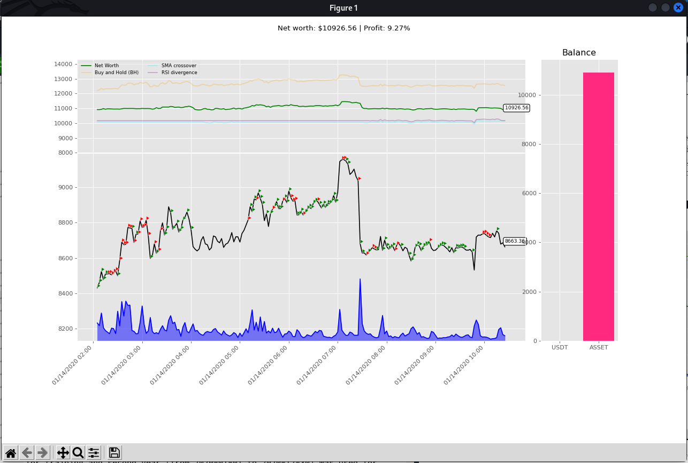

# DRL-trading-bot
Deep Reinforcement learning trading bot

This project provide tools and utils to train and test Deep Reinforcement Learning Trading Agent on Crypto Currency market

## Data Fetcher
Python script to fetch the dataset from the Binance Exchange.
```bash
./fetch_data.py binance --key secrets.json --period 1h --symbol "BTCUSDT" --start-date "2019-01-01" --end-date "2021-01-01" --output dataset/
```

* **--key**: Secret key (API key) for the binance exchange.
* **--period**: Period of data (EX: '1m' '1h' '1d' '1m').
* **--symbol**: Crypto Currency pair symbol (EX: BTCUSDT).
* **--start-date**: Data staring date.
* **--end-date**: Data ending date.
* **--output**: Output folder to save dataset to.


## Trading Environment


* **Data Provider** which is responsible for providing data and observations for the environment.
* **Reward** which is responsible for calculating the value of the reward.
* **Trading Strategy** which is responsible for executing the actions provided by the agent.
* **Rendering component** which is responsible for rendering and providing a visual representation of the trading environment.



## Training/Testing CLI


### Training
```bash
./optimize.py ray_train -a PPO -r sortino -data dataset/binance-BTCUSDT-1h-2019-01__2021-01.csv --add-indicators
```


* **-a**: Algorithm used to train the agent (EX: PPO, A2C ..).
* **-r**: Reward function used (EX: simple\_profit, sharp, sortino).
* **-data** Dataset used to train.
* **--add_indicators**: This flag when set technical indicators are added to the observation space.
* **-lstm**: This flag wraps agent network with lstm layer.


### Testing

```bash
./optimize.py ray_test -a PPO -r simple_profit -data dataset/binance-BTCUSDT-1h-2019-01__2021-01.csv --add-indicators -id binance-BTCUSDT-1h-lite_0_2022-05-13_17-53-55 --episodes 3 -ns 160 --render
```

* **-a**: Algorithm used to train the agent (EX: PPO, A2C ..).
* **-r**: Reward function used (EX: simple\_profit, sharp, sortino).
* **-data** Dataset used to train.
* **--add\_indicators**: This flag when set technical indicators are added to the observation space.
* **-lstm**: This flag wraps agent network with lstm layer.
* **-id**: Id of the model we want to test.
* **--episodes**: Number of episodes to test on.
* **-ns**: List checkpoints we want to test.
* **--render**: This flag trigger environment rendering.
